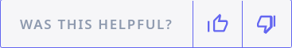
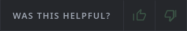
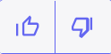
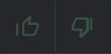
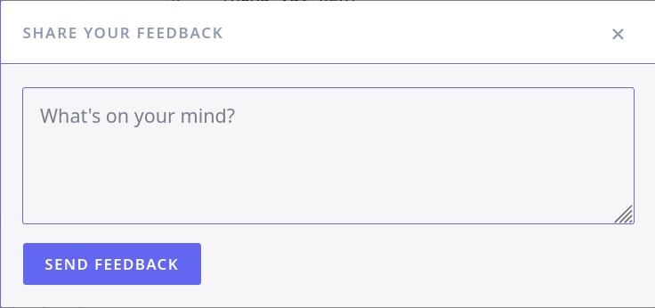
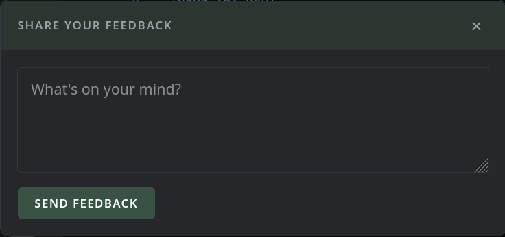

# @inputbuffer/feedback

[InputBuffer](https://inputbuffer.io) is a feedback platform built for developer-facing products. It collects feedback from your users and uses AI-driven categorization to surface patterns.

This package is a lightweight embeddable widget you can drop into your documentation sites, API and SDK references, CLI docs, or any other web property.

---

## Table of contents

- [Quick start](#quick-start)
  - [Inline thumbs bar](#inline-thumbs-bar-web-component)
  - [Thumbs only](#thumbs-only-web-component)
  - [Floating thumbs bar](#floating-thumbs-bar-web-component)
  - [Modal](#modal-script-tag)
  - [Verify it's working](#verify-its-working)
  - [Troubleshooting](#troubleshooting)
- [Installation](#installation)
  - [CDN](#cdn-recommended)
  - [npm](#npm)
  - [Browser support](#browser-support)
- [Reference](#reference)
- [Feedback bar](#feedback-bar)
  - [Web component](#web-component)
  - [`createBar(config)`](#inputbufferiocreatebarconfig)
  - [`bar.on(event, handler)`](#baronevent-handler)
  - [`bar.destroy()`](#bardestroy)
- [Feedback modal](#feedback-modal)
  - [Script tag attributes](#script-tag-attributes-auto-init)
  - [`createModal(config)`](#inputbufferiocreatemodal config)
  - [`instance.open(options?)`](#instanceopenoptions)
  - [`instance.close()`](#instanceclose)
  - [`instance.destroy()`](#instancedestroy)
  - [`instance.on(event, handler)`](#instanceonevent-handler)
  - [`InputBufferIO.version`](#inputbufferioversion)
- [Target metadata schemas](#target-metadata-schemas)
- [CSS customization](#css-customization)
  - [Modal selectors](#modal-selectors)
  - [Bar selectors](#bar-selectors)
  - [CSS custom properties](#css-custom-properties)
- [Common tasks](#common-tasks)
- [License](#license)

---

## Quick start

Before you start you will need a widget API key from your [InputBuffer dashboard](https://inputbuffer.io).

There are three bundles — pick the one that matches your use case:

| Bundle | Size | What it includes |
|---|---|---|
| `bar.js` | 18 KB | Thumbs up/down bar with optional follow-up form |
| `modal.js` | 19 KB | Full-text feedback modal |
| `widget.js` | 36 KB | Both bar and modal |

### Inline thumbs bar (web component)

The simplest way to add feedback. Drop the script tag anywhere in your page, then place the web component where you want the bar to appear:

```html
<script src="https://cdn.jsdelivr.net/npm/@inputbuffer/feedback/dist/bar.js"></script>

<inputbuffer-feedback
  api-key="YOUR_WIDGET_TOKEN"
  label="Was this helpful?">
</inputbuffer-feedback>
```

The bar renders inline with thumbs up/down buttons. After a vote, a short follow-up form appears so the user can add context. On submit, the feedback is sent to InputBuffer.

| Light | Dark |
|---|---|
|  |  |

### Thumbs only (web component)

Omit the `label` attribute to show just the thumbs with no text:

```html
<script src="https://cdn.jsdelivr.net/npm/@inputbuffer/feedback/dist/bar.js"></script>

<inputbuffer-feedback api-key="YOUR_WIDGET_TOKEN"></inputbuffer-feedback>
```

| Light | Dark |
|---|---|
|  |  |

### Floating thumbs bar (web component)

Add `placement="fixed"` to pin the bar to the bottom of the viewport — useful for documentation pages where you want persistent feedback access:

```html
<script src="https://cdn.jsdelivr.net/npm/@inputbuffer/feedback/dist/bar.js"></script>

<inputbuffer-feedback
  api-key="YOUR_WIDGET_TOKEN"
  label="Was this helpful?"
  placement="fixed">
</inputbuffer-feedback>
```

### Modal (script tag)

If you want a full-text feedback modal triggered by a button, load `modal.js` with your API key and a CSS selector for the trigger element:

| Light | Dark |
|---|---|
|  |  |

```html
<button id="feedback-btn">Send feedback</button>

<script src="https://cdn.jsdelivr.net/npm/@inputbuffer/feedback/dist/modal.js"
    data-api-key="YOUR_WIDGET_TOKEN"
    data-attach-to="#feedback-btn">
</script>
```

When the page loads the widget connects to `#feedback-btn`. Clicking it opens a modal with a text field and optional email field.

### Verify it's working

Submit a test message from your page and open your InputBuffer dashboard. It should appear in your feedback inbox within a few seconds, already categorized.

### Troubleshooting

- **Nothing happens on click:** check that the `data-attach-to` selector matches your button's `id` exactly, including the `#`.
- **401 error:** your `data-api-key` is invalid — try again with a fresh copy from the dashboard, and if it still fails [contact us](https://inputbuffer.io/contact).

### Where to go from here

- Customize the bar with `label`, `placement`, and theme attributes (see [Web component](#web-component))
- Create the bar programmatically with `createBar()` for full config access (see [`InputBufferIO.createBar(config)`](#inputbuffercreatebarconfig))
- Listen for vote and submit events (see [`bar.on(event, handler)`](#baronevent-handler))

---

## Installation

### CDN (recommended)

Load only the component you need — each is roughly half the full bundle:

```html
<!-- Full bundle (modal + bar) — 36 KB -->
<script src="https://cdn.jsdelivr.net/npm/@inputbuffer/feedback/dist/widget.js"
    data-api-key="YOUR_WIDGET_TOKEN">
</script>

<!-- Modal only — 19 KB -->
<script src="https://cdn.jsdelivr.net/npm/@inputbuffer/feedback/dist/modal.js"
    data-api-key="YOUR_WIDGET_TOKEN">
</script>

<!-- Bar only — 18 KB -->
<script src="https://cdn.jsdelivr.net/npm/@inputbuffer/feedback/dist/bar.js"></script>
```

> **SRI note:** For production deployments, add a Subresource Integrity `integrity` attribute to guard against CDN compromise. Generate the hash for each pinned version with:
> ```bash
> curl -s https://cdn.jsdelivr.net/npm/@inputbuffer/feedback@0.1.0/dist/widget.js | openssl dgst -sha384 -binary | openssl base64 -A
> ```
> Then use `integrity="sha384-<hash>" crossorigin="anonymous"` on the `<script>` tag.

The stylesheet is injected automatically — no separate `<link>` tag needed. Pass `data-inject-styles="false"` to opt out and load `dist/modal.css` or `dist/bar.css` yourself.

> **CSP note:** Style injection requires `style-src 'unsafe-inline'` in your Content Security Policy. If your CSP blocks inline styles, pass `data-inject-styles="false"` (or `injectStyles: false` in `createModal()`) and load the stylesheet manually via `<link>` instead.

### npm

```bash
npm install @inputbuffer/feedback
```

Import only what you use — your bundler will tree-shake the rest:

```js
// Modal only (~19 KB unminified)
import { createModal } from '@inputbuffer/feedback/modal';

// Bar only (~18 KB unminified)
import { createBar } from '@inputbuffer/feedback/bar';

// Full bundle
import { InputBufferIO } from '@inputbuffer/feedback';
```

TypeScript types are included and exported from each entry point.

### Browser support

Chrome 111+, Firefox 113+, Safari 16.2+. The bundles target ES2019 and rely on Custom Elements v1 (used by the `<inputbuffer-feedback>` web component).

---

## Reference

Each CDN bundle sets `window.InputBufferIO` at parse time — no `DOMContentLoaded` needed. What's exposed depends on which bundle you load:

| Bundle | `window.InputBufferIO` |
|---|---|
| `widget.js` | `{ createModal, createBar, version }` |
| `modal.js` | `{ createModal, version }` |
| `bar.js` | `{ createBar, version }` |

When using npm imports, use the named exports directly (`createModal`, `createBar`) rather than the global.

---

## Feedback bar

The feedback bar is an inline or fixed thumbs up/down component — a lightweight alternative to the modal. It can be used as a web component or created programmatically.

### Web component

```html
<script src="https://cdn.jsdelivr.net/npm/@inputbuffer/feedback/dist/bar.js"></script>

<inputbuffer-feedback api-key="YOUR_WIDGET_TOKEN" label="Was this helpful?"></inputbuffer-feedback>
```

Supported attributes:

| Attribute | Description |
|---|---|
| `api-key` | **Required.** Your widget API key. |
| `api-url` | Override the API endpoint. |
| `label` | Text shown next to the thumbs. |
| `placement` | `"inline"` (default) or `"fixed"` (pins to bottom of viewport). |
| `theme-primary` | Primary color. |
| `theme-background` | Background color. |
| `theme-text` | Text color. |
| `theme-selected` | Background color of the selected thumb. |
| `theme-selected-color` | Icon color of the selected thumb. |
| `inject-styles` | Set to `"false"` to skip automatic style injection. |
| `color-scheme` | `"light"`, `"dark"`, or `"auto"`. |
| `show-label` | `"true"` to show the label, `"false"` to hide it. |
| `modal-title` | Title shown above the feedback textarea. |
| `modal-placeholder` | Placeholder text for the feedback textarea. |
| `show-title-field` | `"true"` to show an optional title input. |
| `show-email-field` | `"true"` to show an optional email input. |
| `source` | Identifier for the feedback source. |
| `user-id` | Stable user identifier for reaction deduplication. When set, only one reaction per user is recorded per target (all-time). When omitted, deduplication falls back to IP address with a 24-hour window. |

### `InputBufferIO.createBar(config)`

Creates a feedback bar programmatically and returns a `FeedbackBarInstance` with an `element` property (mount it yourself) and a `destroy()` method.

```js
const bar = InputBufferIO.createBar({
    apiKey: 'YOUR_WIDGET_TOKEN',
    label: 'Was this helpful?',
});
document.getElementById('my-slot').appendChild(bar.element);
```

| Property | Type | Default | Description |
|---|---|---|---|
| `apiKey` | string | — | **Required.** Your widget API key. |
| `apiUrl` | string | — | Override the API endpoint. |
| `label` | string | — | Text shown next to the thumbs. |
| `showLabel` | boolean | `true` | Set to `false` to show thumbs only. |
| `placement` | `'inline'` \| `'fixed'` | `'inline'` | `fixed` pins the bar to the bottom of the viewport. |
| `colorScheme` | `'light'` \| `'dark'` \| `'auto'` | `'auto'` | Force a color scheme or follow the system setting. |
| `theme.primary` | string | — | Primary color (buttons, focus rings). |
| `theme.background` | string | — | Bar and popover background color. |
| `theme.surface` | string | — | Popover header surface color. |
| `theme.text` | string | — | Text color. |
| `theme.selected` | string | — | Background color of the selected thumb. |
| `theme.selectedColor` | string | — | Icon color of the selected thumb. |
| `target.type` | `'documentation'` \| `'rest_endpoint'` \| `'cli_command'` | — | The kind of thing the user is giving feedback on. Used for AI categorization. |
| `target.targetId` | string | — | Optional stable ID for this target (used for deduplication on the server). |
| `target.displayName` | string | — | Human-readable name shown in the InputBuffer dashboard (max 500 chars). |
| `target.dedupKey` | string | — | Custom deduplication key (max 500 chars). |
| `target.metadata` | object | — | Type-specific fields — see [Target metadata schemas](#target-metadata-schemas). |
| `modalTitle` | string | — | Heading for the follow-up popover. |
| `modalPlaceholder` | string | — | Textarea placeholder for the follow-up popover. |
| `showEmailField` | boolean | `false` | Show/hide the email field in the follow-up popover. |
| `showTitleField` | boolean | `false` | Show/hide the title field in the follow-up popover. |
| `source` | string | — | Tag identifying which of your surfaces this widget is embedded on (e.g. `"ios-app"`, `"docs-site"`). Stored on every submission for filtering in the dashboard. |
| `userId` | string | — | Stable user identifier for reaction deduplication. When set, only one reaction per user is recorded per target (all-time). When omitted, deduplication falls back to IP address with a 24-hour window. |
| `injectStyles` | boolean | `true` | Set to `false` to skip automatic style injection. |

### `bar.on(event, handler)`

Subscribes to bar lifecycle events.

```js
bar.on('vote',   ({ sentiment }) => console.log('Voted:', sentiment));
bar.on('open',   ({ sentiment }) => console.log('Popover opened after:', sentiment));
bar.on('submit', ({ id })        => console.log('Feedback ID:', id));
bar.on('close',  ()              => console.log('Popover closed'));
bar.on('error',  (err)           => console.error('Submission failed:', err));
```

| Event | Handler signature | When it fires |
|---|---|---|
| `vote` | `({ sentiment: 'positive' \| 'negative' }) => void` | User clicks a thumb. The reaction is recorded immediately via the reactions API (if a `target` is configured), and the selection is persisted in `localStorage` for 24 hours so it survives page reloads. |
| `open` | `({ sentiment: 'positive' \| 'negative' }) => void` | The follow-up popover opens. |
| `submit` | `({ id: string }) => void` | Feedback was submitted successfully. |
| `close` | `() => void` | The follow-up popover closes. |
| `error` | `(err: Error) => void` | The submission request failed. |

### `bar.destroy()`

Removes the bar element and all event listeners.

---

## Feedback modal

The feedback modal is a full-text input form triggered by a button click. It can be opened programmatically or auto-initialized from the script tag.

### Script tag attributes (auto-init)

When `data-api-key` is present on the script tag, the widget initializes automatically. All config is read from `data-*` attributes.

| Attribute | Type | Description |
|---|---|---|
| `data-api-key` | string | **Required.** Your widget API key. |
| `data-api-url` | string | Override the API endpoint (useful for local dev/testing). |
| `data-attach-to` | string | CSS selector for the element that opens the modal on click. |
| `data-inject-styles` | boolean | Set to `"false"` to skip automatic style injection. |
| `data-color-scheme` | string | `"light"`, `"dark"`, or `"auto"`. |
| `data-theme-primary` | string | Primary color (buttons, focus rings). Any CSS color value. |
| `data-theme-background` | string | Modal background color. |
| `data-theme-text` | string | Modal text color. |
| `data-theme-selected` | string | Background color of the selected sentiment thumb. |
| `data-theme-selected-color` | string | Icon color of the selected sentiment thumb. |

> **Note:** `theme.surface` is only available via the programmatic API (`createModal(config)`), not as a `data-*` attribute.

### `InputBufferIO.createModal(config)`

Creates a widget instance programmatically. Returns a `WidgetInstance`.

```js
const ib = InputBufferIO.createModal({
    apiKey: 'YOUR_WIDGET_TOKEN',
});
```

| Property | Type | Default | Description |
|---|---|---|---|
| `apiKey` | string | — | **Required.** Your widget API key. |
| `apiUrl` | string | — | Override the API endpoint (useful for local dev/testing). |
| `attachTo` | string | — | CSS selector. Clicking the matched element calls `open()`. |
| `injectStyles` | boolean | `true` | Set to `false` to skip automatic style injection. |
| `title` | string | — | Modal heading. Omit to render no title. |
| `placeholder` | string | `"What's on your mind?"` | Textarea placeholder text. |
| `showEmailField` | boolean | `false` | Set to `true` to show an optional email field. |
| `showTitleField` | boolean | `false` | Set to `true` to show an optional title field. |
| `showSentiment` | boolean | `false` | Show thumbs up/down sentiment buttons in the modal. |
| `source` | string | — | Tag identifying which of your surfaces this widget is embedded on (e.g. `"ios-app"`, `"docs-site"`). Stored on every submission for filtering in the dashboard. |
| `colorScheme` | `'light'` \| `'dark'` \| `'auto'` | `'auto'` | Force a color scheme or follow the system setting. |
| `theme.primary` | string | — | Primary color (buttons, focus rings). |
| `theme.background` | string | — | Modal background color. |
| `theme.surface` | string | — | Modal header surface color. |
| `theme.text` | string | — | Modal text color. |
| `theme.selected` | string | — | Background color of the selected sentiment thumb. |
| `theme.selectedColor` | string | — | Icon color of the selected sentiment thumb. |

### `instance.open(options?)`

Opens the feedback modal. Pass options to provide context at call time — useful when the same widget instance is reused across different pages or sections.

```js
ib.open({
    title: 'Was this helpful?',
    target: {
        type: 'documentation',
        targetId: 'auth-overview',
        displayName: 'Authentication overview',
        metadata: {
            page_url: window.location.href,
            section_heading: 'Authentication',
        },
    },
    prefill: {
        description: '👍 This page was helpful',
    },
});
```

| Property | Type | Description |
|---|---|---|
| `title` | string | Overrides the modal heading for this open call. |
| `sentiment` | `'positive'` \| `'negative'` | Pre-selects a sentiment thumb. Only relevant when `showSentiment` is enabled. |
| `target.type` | `'documentation'` \| `'rest_endpoint'` \| `'cli_command'` | The kind of thing the user is giving feedback on. Used for AI categorization. |
| `target.targetId` | string | Optional stable ID for this target (used for deduplication on the server). |
| `target.displayName` | string | Human-readable name shown in the InputBuffer dashboard (max 500 chars). |
| `target.dedupKey` | string | Custom deduplication key (max 500 chars). |
| `target.metadata` | object | Type-specific fields — see [Target metadata schemas](#target-metadata-schemas). |
| `prefill.email` | string | Pre-populates the email field. |
| `prefill.description` | string | Pre-populates the textarea. |
| `source` | string | Overrides the `source` set in `createModal(config)` for this open call. |

### `instance.close()`

Closes the modal programmatically.

### `instance.destroy()`

Closes the modal and removes all event listeners and DOM elements. The instance cannot be reused after this call — invoke `createModal()` again to get a fresh one. You may have multiple `WidgetInstance`s on a page, but opening more than one modal simultaneously is not supported (they share DOM IDs).

### `instance.on(event, handler)`

Subscribes to widget lifecycle events.

```js
ib.on('submit', (result) => console.log('Feedback ID:', result.id));
ib.on('close',  ()       => console.log('Modal closed'));
ib.on('error',  (err)    => console.error('Submission failed:', err));
```

| Event | Handler signature | When it fires |
|---|---|---|
| `submit` | `(result: { id: string }) => void` | Feedback was submitted successfully. `result.id` is the InputBuffer feedback ID. |
| `close` | `() => void` | The modal was closed, either by the user or programmatically. |
| `error` | `(err: Error) => void` | The submission request failed. |

### `InputBufferIO.version`

The currently loaded widget version string.

```js
console.log(InputBufferIO.version); // e.g. "0.1.0"
```

### Target metadata schemas

The fields accepted in `target.metadata` depend on `target.type`. The server validates required fields; the client does not enforce them.

**`documentation`**

| Field | Required | Description |
|---|---|---|
| `page_url` | No | Full URL of the page. |
| `page_slug` | No | Slug or path of the page. |
| `section_heading` | No | Heading of the section the user is viewing. |
| `doc_version` | No | Documentation version string. |

**`rest_endpoint`**

| Field | Required | Description |
|---|---|---|
| `method` | Yes* | HTTP method (`GET`, `POST`, etc.). |
| `path` | Yes* | API path (e.g. `/v1/users`). |
| `host` | No | Hostname (e.g. `api.example.com`). |
| `api_version` | No | API version string. |

**`cli_command`**

| Field | Required | Description |
|---|---|---|
| `command` | Yes* | Top-level CLI command (e.g. `auth`). |
| `subcommand` | No | Subcommand (e.g. `setup`). |
| `cli_version` | No | CLI version string. |

\* Required by the server; omitting them will result in a validation error response.

---

## CSS customization

Each component uses stable selectors you can target directly in your stylesheet.

### Modal selectors

| Selector | Class alias | Element |
|---|---|---|
| `#ib-overlay` | — | Full-screen backdrop |
| `#ib-modal` | — | Modal container (scopes all CSS variables) |
| `#ib-modal-header` | — | Header bar |
| `#ib-modal-body` | — | Body area |
| `#ib-title` | `.ib-modal-title` | Modal heading |
| `#ib-textarea` | `.ib-modal-textarea` | Feedback text field |
| `#ib-email` | `.ib-modal-email` | Email input |
| `#ib-submit` | `.ib-modal-submit` | Submit button |
| `#ib-close` | `.ib-modal-close` | Close button |
| `#ib-success` | `.ib-modal-success` | Success message |
| `#ib-error` | `.ib-modal-error` | Error message |

The IDs are the stable public API and will not change between releases. The `.ib-modal-*` class aliases are equivalent and exist for symmetry with the bar.

### Bar selectors

| Class | Element |
|---|---|
| `.ib-bar-wrapper` | Outer wrapper (scopes all CSS variables) |
| `.ib-bar` | The visible bar strip |
| `.ib-bar-label` | Label text |
| `.ib-bar-btn` | Thumb buttons |
| `.ib-bar-popover` | Follow-up popover container |
| `.ib-bar-header` | Popover header |
| `.ib-bar-body` | Popover body |
| `.ib-bar-title` | Popover heading |
| `.ib-bar-textarea` | Feedback text field |
| `.ib-bar-email` | Email input |
| `.ib-bar-submit` | Submit button |
| `.ib-bar-success` | Success message |
| `.ib-bar-error` | Error message |

### CSS custom properties

Both components expose the same set of CSS custom properties. Set them on `#ib-modal` or `.ib-bar-wrapper` respectively, or pass them via the `theme` config option.

| Property | Default (light) | Default (dark) | What it affects |
|---|---|---|---|
| `--ib-primary` | `#6366f1` | `#3A5244` | Buttons, focus rings, borders |
| `--ib-primary-hover` | `#4338ca` | `#4E6857` | Button hover state |
| `--ib-background` | `#f6f6f8` | `#25272B` | Form area background |
| `--ib-surface` | `#ffffff` | `#2C3630` | Header/card background |
| `--ib-text` | `#111827` | `#E5E7EB` | Body text |
| `--ib-muted` | `#8d99ae` | `#9CA3AF` | Label and hint text |
| `--ib-border` | `(primary)` | `#363840` | Border color |
| `--ib-selected` | `(primary)` | `(primary)` | Selected thumb background |
| `--ib-selected-color` | `(surface)` | `(surface)` | Selected thumb icon color |
| `--ib-radius` | `2px` | `8px` | Container border radius |
| `--ib-radius-input` | `2px` | `4px` | Input/button border radius |

---

## Common tasks

### Attach feedback to a specific docs page

```js
// <script src="https://cdn.jsdelivr.net/npm/@inputbuffer/feedback/dist/modal.js" data-api-key="YOUR_WIDGET_TOKEN"></script>
const ib = InputBufferIO.createModal({ apiKey: 'YOUR_WIDGET_TOKEN' });

document.getElementById('feedback-btn').addEventListener('click', () => {
    ib.open({
        title: 'Was this page helpful?',
        target: {
            type: 'documentation',
            targetId: window.location.pathname,
            displayName: document.title,
            metadata: {
                page_url: window.location.href,
                section_heading: document.querySelector('h1')?.textContent ?? '',
            },
        },
    });
});
```

### Attach feedback to a REST endpoint reference

```js
// <script src="https://cdn.jsdelivr.net/npm/@inputbuffer/feedback/dist/modal.js" data-api-key="YOUR_WIDGET_TOKEN"></script>
const ib = InputBufferIO.createModal({ apiKey: 'YOUR_WIDGET_TOKEN' });

ib.open({
    target: {
        type: 'rest_endpoint',
        targetId: 'POST /v1/uploads',
        displayName: 'Upload a file',
        metadata: { method: 'POST', path: '/v1/uploads' },
    },
});
```

### Attach feedback to a CLI command reference

```js
// <script src="https://cdn.jsdelivr.net/npm/@inputbuffer/feedback/dist/modal.js" data-api-key="YOUR_WIDGET_TOKEN"></script>
const ib = InputBufferIO.createModal({ apiKey: 'YOUR_WIDGET_TOKEN' });

ib.open({
    target: {
        type: 'cli_command',
        targetId: 'deploy',
        displayName: 'my-cli deploy',
        metadata: { command: 'deploy' },
    },
});
```

### Listen for submissions

```js
// <script src="https://cdn.jsdelivr.net/npm/@inputbuffer/feedback/dist/modal.js" data-api-key="YOUR_WIDGET_TOKEN"></script>
const ib = InputBufferIO.createModal({ apiKey: 'YOUR_WIDGET_TOKEN' });

ib.on('submit', ({ id }) => {
    analytics.track('feedback_submitted', { feedbackId: id });
});

ib.on('error', (err) => {
    console.error('Feedback submission failed:', err.message);
});
```

### Force a dark theme

```js
// <script src="https://cdn.jsdelivr.net/npm/@inputbuffer/feedback/dist/modal.js" data-api-key="YOUR_WIDGET_TOKEN"></script>
InputBufferIO.createModal({
    apiKey: 'YOUR_WIDGET_TOKEN',
    colorScheme: 'dark',
    theme: {
        primary: '#818cf8',
        background: '#1e1e2e',
        text: '#cdd6f4',
    },
}).open();
```

### Add a thumbs bar to a docs page

```html
<script src="https://cdn.jsdelivr.net/npm/@inputbuffer/feedback/dist/bar.js"></script>

<inputbuffer-feedback api-key="YOUR_WIDGET_TOKEN" label="Was this helpful?"></inputbuffer-feedback>
```

### Load only the bar via npm

```js
import { createBar } from '@inputbuffer/feedback/bar';

const bar = createBar({ apiKey: 'YOUR_WIDGET_TOKEN', label: 'Was this helpful?' });
document.getElementById('my-slot').appendChild(bar.element);
```

### Load your own CSS instead of the injected styles

```html
<link rel="stylesheet" href="https://cdn.jsdelivr.net/npm/@inputbuffer/feedback/dist/modal.css">

<script src="https://cdn.jsdelivr.net/npm/@inputbuffer/feedback/dist/modal.js"
    data-api-key="YOUR_WIDGET_TOKEN"
    data-inject-styles="false">
</script>
```

## `source` vs `target`

These are two separate concepts:

- **`source`** — *where* your widget is deployed. Identifies the platform or product surface, 
  e.g. `"website"`, `"ios-app"`, `"chrome-extension"`. Use this to filter feedback by deployment 
  environment in your dashboard.

- **`target`** — *what* the feedback is about. A structured object describing the specific content 
  or feature, e.g. a REST endpoint, a docs page, or a CLI command. Use this to group feedback by 
  the thing being reviewed, regardless of where the widget is embedded.

You can use both together:
```js
InputBufferIO.createBar({
    apiKey: 'YOUR_WIDGET_TOKEN',
    source: 'website',
    target: { type: 'documentation', metadata: { page_slug: 'getting-started' } },
});


---

## License

MIT
